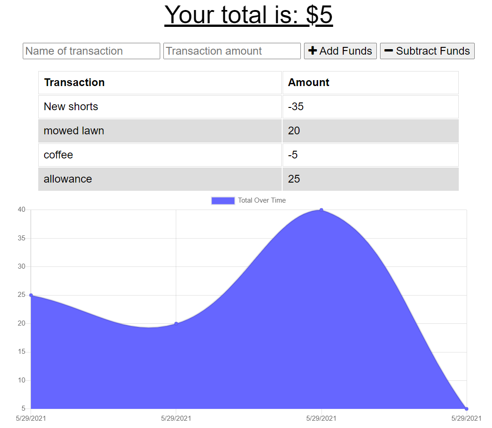

# Budget Tracker

## Description:
As a traveler you can track your withdrawals & desposits whether you have data/internet connection or not. This way your account balance is accurate no matter where you are on the globe. 

## Licensing:

## Table of Contents 
* [Description](#description)
* [Installation](#installation)
* [Usage](#usage)
* [Technology](#technology)
* [Questions](#questions)
* [Screenshot](#screenshot)

## Installation:
- npm i express
- npm i
- npm i idb
- npm i mongoose

## Usage:
https://polar-wildwood-09716.herokuapp.com/

## Technology:
- Express
- IndexedDB
- Service Workers
- Web Manifest
- MongoDB

## Questions:
Please reach me through my Github account or email with any additional questions.
- Github: [tessaustin](https://github.com/tessaustin)
- Email: tessaustin92@gmail.com 

## Screenshot: 
